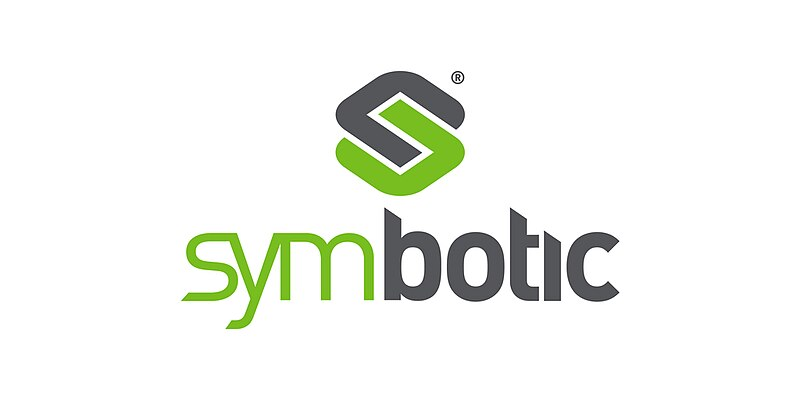

Multi-Agent Path Finding (MAPF) involves computing collision-free paths for multiple agents from their starting locations to given destinations in a known environment. This problem finds diverse applications, from robot coordination to traffic management. Researchers in artificial intelligence, robotics, and theoretical computer science have been actively exploring various MAPF problem variants and solution approaches. This workshop aims to bring these researchers together to present their research, discuss future research directions, and cross-fertilize the different communities.

WoMAPF 2025 is kindly supported by [Symbotic](https://www.symbotic.com/) and [SoCS](https://www.search-conference.org/).

## News

- Feb. 11, 2025. Update invited talk info.
- Feb. 4, 2025. Workshop schedule is out.
- Dec. 27, 2024. Call for the WoMAPF student travel grants is out.
- Dec. 13, 2024. Paper notification has sent out.
- Nov. 25, 2024: Submission is closed. Paper notification will be slightly extended (Dec. 12).
- Oct. 12, 2024: The submission site is now open.

---

## Important Dates

Note: all deadlines are “anywhere on earth” (UTC-12)

- Student travel grants application: January 13, 2025
- Final version submission: January 13, 2025
- Paper submission deadline: November 24, 2024
- Paper notification: ~~December 9, 2024~~ => December 12, 2024
- Final version: January 9, 2025
- Student travel grants application: January 13, 2025
- Workshop: March 3, 2025

## Topics

All works that relate to collision-free path planning or navigation for multiple agents are welcome, including but not limited to:
- Search-, rule-, reduction-, reactive-, and learning-based MAPF planners;
- MAPF solvers for non-grid non-point agents (e.g. continuous space, robot arms, etc);
- MAPF methods for execution monitoring, replanning, robustness to delays, etc;
- Combination of MAPF and task allocation, scheduling, etc.;
- Real-world applications of MAPF planners;
- Multi-agent machine learning for centralized and decentralized MAPF;
- Customization of MAPF planners for actual robots (e.g. motion and communication constraints, environment changes, etc.);
- Standardization of MAPF terminology and benchmarks.

## Format of Workshop

The workshop is a One-Day workshop including:
- Invited talk
- Paper presentations and Q&As
- Community discussion
- Industry panel session

The industry panel, newly introduced, aims to foster stronger connections and bridge the gap between industry and the MAPF research community.

Please note that AAAI requires all presentations to be delivered in person and virtual attendance is permitted for general participation only.

## Workshop Schdule

| Time (EST) | Activities and Presentation Topic | Authors/Presenters |
|------------|---------------------------------|--------------------|
| 08:55 | __Opening Remarks__ | |
| 09:00 | Enhancing Lifelong Multi-Agent Path-finding by Using Artificial Potential Fields | Arseni Pertzovskiy, Roni Stern, Roie Zivan, Ariel Felner |
|  | Online Guidance Graph Optimization for Lifelong Multi-Agent Path Finding | Hongzhi Zang, Yulun Zhang, He Jiang, Zhe Chen, Daniel Harabor, Peter Stuckey, Jiaoyang Li |
|  | Early Results with LF: Online Multi-Robot Path Planning meets Optimal Trajectory Control | Ajay Shankar, Keisuke Okumura, Amanda Prorok |
|  | Concurrent Planning and Execution in Lifelong Multi-Agent Path Finding with Delay Probabilities | Yue Zhang, Zhe Chen, Daniel Harabor, Pierre Le Bodic, Peter Stuckey |
|  | Optimized Solving Anonymous and Combinatorial Multi-Agent Path Finding Problems in Polynomial Time | Stefan Edelkamp |
| 09:40 | __Break (15 mins)__ | |
| 09:55 | __Invited Talk (45 minutes)__ | Chuchu Fan |
| 10:40 | __Tea Break (20 mins)__ | |
| 11:00 | On the Completeness of Conflict-Based Search: Temporally-Relative Duplicate Pruning | Thayne T. Walker, Nathan R. Sturtevant |
|  | Goal Distribution in Conflict-Based Search for Multi-Agent Pathfinding and its Implications to Monte-Carlo Sampling | Colton Simpson, Sumedh Pendurkar, Guni Sharon |
|  | Minimizing Makespan with Conflict-Based Search for Optimal Multi-Agent Path Finding | Amir Maliah, Dor Atzmon, Ariel Felner |
|  | CBS with Continuous-Time Revisit | Andy Li, Zhe Chen, Daniel Harabor |
|  | Multi-Agent Motion Planning For Differential Drive Robots Through Stationary State Search | Jingtian Yan, Jiaoyang Li |
|  | How Constraints Define Control for Multi-Agent Navigation Robots | Boyang Zhang |
|  | Hierarchical Large Scale Multirobot Path (Re)Planning | Lishuo Pan, Kevin Hsu, Nora Ayanian |
| 12:00 | __Poster Session with Lunch in Workshop (80 mins)__ | |
||
|| Presentations above are assigned to the morning poster session / below to the afternoon |
||
| 13:20 | Deep Reinforcement Learning based Truck Dispatcher for Open-pit Mines | Vaibhav Mukundan, Apurva Narayan |
|  | Multi-Robot Motion Planning with Diffusion Models | Yorai Shaoul, Itamar Mishani, Shivam Vats, Jiaoyang Li, Maxim Likhachev |
|  | Multi-Agent Path Finding in Continuous Spaces with Projected Diffusion Models | Jinhao Liang, Jacob Christopher, Sven Koenig, Ferdinando Fioretto |
|  | Multi-Agent Path Finding for Schedule Constrained Automation | Kareem Eissa, Rayal Prasad, Ankur Kapoor |
|  | A Quality Diversity Approach to Automatically Generate Multi-Agent Path Finding Benchmark Maps | Cheng Qian, Yulun Zhang, Varun Bhatt, Matthew Fontaine, Stefanos Nikolaidis, Jiaoyang Li |
| 14:00 | __Break (15 mins)__ | |
| 14:15 | __Industry Panel Presentations (35 mins)__ | |
| 14:55 | __Industry Panel Discussion (5 mins prep + 35 mins)__ | |
| 15:40 | __Tea Break (20 mins)__ | |
| 16:00 | 100-Mouse System: a Swarm Robotics Platform and its Intuitive State Management User Interface | Ryusei Matsumoto, Shota Yamamoto, Yoko Sasaki, Keisuke Okumura |
|  | COLREG-CBS: COLREGs-Compliant Search-based Path Planning for Autonomous Surface Vehicles | Kumar Jaiswal, Rahul Kulkarni, Saifullah Khan, Shwitaan Iyer, Sujit P. Baliyarasimhuni |
|  | Generalized Multi-Agent Multi-Objective Ergodic Search | Bhaskar Vundurthy, Geordan Gutow, Akshaya Kesarimangalam Srinivasan, Albert Xu, Burhanuddin Shirose, Howie Choset |
|  | Toward Multi-Agent Moving Target Traveling Salesman Problems | Anoop Bhat, Geordan Gutow, Bhaskar Vundurthy, Zhongqiang Ren, Sivakumar Rathinam, Howie Choset |
| 16:35 | __Short Break (10 mins)__
| 16:45 | Generating Safe Policies for Multi-Agent Path Finding with Temporal Uncertainty | Jiří Švancara, David Zahradka, Mrinalini Subramanian, Roman Barták, Miroslav Kulich |
|  | Measure Preserving Flows for Ergodic Search in Convoluted Environments | Albert Xu, Bhaskar Vundurthy, Geordan Gutow, Ian Abraham, Jeff Schneider, Howie Choset |
|  | Lifelong MAPF and Task Assignment Considering Workers in Warehouses | Naoki Mizumoto, Katsuhide Fujita, Yoshihiro Ueda, Takayoshi Mori |
| 17:10 | __Community Discussion__ | |
| 17:20 | __Poster Session with Snacks and Drinks (60 mins)__ | |
| 18:20 | __Closing__ | |

## Invited Talk

Recent Advances in MAPF: Constrained Planning, Temporal Logic, and LLM-Assisted Planning, by [Chuchu Fan](https://chuchu.mit.edu/) (MIT)

__Abstract:__
In this talk, we explore recent advances from my group that tackle complex planning challenges in multi-robot systems. First, we present a hierarchical framework for solving the Constrained Multiple Depot Traveling Salesman Problem (CMDTSP), efficiently incorporating real-world constraints such as battery limits and inter-agent conflicts to improve solution quality and computational efficiency. Next, we discuss a novel approach to multi-agent motion planning under complex temporal constraints using signal temporal logic (STL), where timed waypoints enable task allocation and collision-free motion planning for nonlinear and nonholonomic agents. Finally, we introduce AutoTAMP, a method that leverages large language models (LLMs) as translators and checkers to bridge natural language task descriptions with task-and-motion planning, enabling robots to jointly reason about tasks and motion under intricate environmental and temporal constraints.

__Bio:__
Dr. Chuchu Fan is a pre-tenure associate professor at AeroAstro and LIDS at MIT. Before that, she was a postdoc researcher at Caltech and got her Ph.D. from ECE at the University of Illinois at Urbana-Champaign. Her research group, Realm at MIT, works on using rigorous mathematics, including formal methods, machine learning, and control theory, for the design, analysis, and verification of safe autonomous systems. Chuchu is the recipient of an NSF CAREER Award, an AFOSR Young Investigator Program (YIP) Award, an ONR Young Investigator Program (YIP) Award, and the 2020 ACM Doctoral Dissertation Award.

## Industry Panel

From Click to Delivery: Challenges and Opportunities in Multi-Agent Path Finding at Amazon, by [Federico Pecora](https://www.amazon.science/author/federico-pecora) (Amazon Robotics)

__Abstract:__
Amazon tackles the problem of coordinating hundreds of thousands of robots to go from a website click to a delivery at your door. We leverage problem, heuristic search, and ML to solve this huge optimization problem. In this talk I will provide an overview of the underlying motion, allocation, perception, and manipulation sub-problems, and discuss some of the challenges and opportunities their integration poses for research in MAPF.

__Bio:__
Federico Pecora leads the Movement Science team at Amazon Robotics. His team studies algorithms for efficient motion planning and coordination, with the aim of improving the efficiency the world’s largest fleet of mobile robots. He leads Amazon Robotics’ effort to develop a Foundation Model for structured field mobile robots. Prior to joining Amazon, Federico was head of the Multi-Robot Planning and Control Lab at Örebro University, Sweden, where he was also professor and director of the Computer Science Engineering program.

---

Planning Large-Scale Bot Fleets in High-Density Warehouses, by [Jingkai Chen](https://jkchengh.github.io/) (Symbotic)

__Abstract:__
Planning a large fleet of high-speed robots in Symbotic's high-density warehouses presents unique challenges for the multi-bot planning and execution system. In this talk, I will provide an overview of these challenges and introduce how Symbotic's planning-execution system builds upon state-of-the-art multi-robot approaches to achieve robustness, high performance, and scalability.

__Bio:__
Jingkai Chen is a Principal Robotics Engineer at Symbotic, where he leads the group focused on multi-robot planning and execution. He spearheaded the research and development of the latest generation of Symbotic’s multi-bot routing and execution system, significantly improving its robustness, scalability, and performance. This system is deployed across a dozen warehouse sites, coordinating thousands of robots at scale.

Jingkai holds an S.M. and Ph.D. in autonomy from MIT’s Department of Aeronautics and Astronautics. His research interests include robotics, AI planning, and multi-agent systems, with applications in interconnected robotic systems for manufacturing, logistics, and field operations.

---

_Information on the other panellists will be available soon._

<!-- We've confirmed the participation from Amazon Robotics and Symbotic – both are leading companies in robotics and warehouse automation. We're also reaching out to other companies who are applying automation in diverse and innovative ways to further enrich the discussions. -->

## Submission Requirements (Closed)

Submissions can contain relevant work in all possible stages, including work that was recently published, is under submission elsewhere, was only recently finished, or is still ongoing.

- Format: Any format is acceptable.
- Page limitation: There is no limit on the number of pages.

All submissions will receive at least 2 light reviews.
The review process will be __single-blind__.

## Submission Site (Closed)

[https://cmt3.research.microsoft.com/WoMAPF2025/Submission/Index](https://cmt3.research.microsoft.com/WoMAPF2025/Submission/Index)

## Call for Student Travel Grants (Closed)

Thanks to the generous support of our sponsor Symbotic and SoCS, we are pleased to announce the WoMAPF Student Travel Grants.
Winners will receive a fixed amount of travel support, which is expected to be around 1,000 USD.
The exact amount will depend on the number of other applicants.

To be eligible, an applicant must be either:
- a student presenting their work at the MAPF workshop,
- a student presenting a relevant paper at the main conference who also plans to attend WoMAPF, or
- a student who does not have a presentation this time, but is very keen to contribute to MAPF studies.

The organizing committee will select several winners based on:
- the applicant's CV,
- a student certificate such as a copy of a student ID card, and
- a one-page PDF description of your contribution to MAPF, not limited to this workshop, and why you need financial support such as travel costs.

Additionally, it would be helpful if you could indicate the amount of other funding you have already received. Priority will be given to students who are actively involved in MAPF, taking into account their place of residence.

Please submit your application via the following page.

[https://forms.gle/13BXVT2fA7tCEaBY6](https://forms.gle/13BXVT2fA7tCEaBY6)

The deadline for applications is __13 January 2025, UTC-12__. Notification is expected within that week.
Instructions for the transfer process will be provided after notification.
We plan to transfer the grants after the workshop day.

We are looking forward to your applications!

## Workshop Committee

- Zhe Chen, Monash University (zhe.chen [at] monash.edu)
- [Jingkai Chen](https://jkchengh.github.io/), Symbotic (jichen [at] symbotic.com)
- [Keisuke Okumura](https://kei18.github.io/), University of Cambirdge / AIST (ko393 [at] cam.ac.uk)
- [Rishi Veerapaneni](https://rishi-v.github.io/), Carnegie Mellon University (vrishi [at] cmu.edu)
- Yue Zhang , Monash University (yue.zhang [at] monash.edu)

## Advisory Board

- [Jiaoyang Li](https://jiaoyangli.me/), Carnegie Mellon University
- [Daniel Harabor](https://harabor.net/daniel/), Monash University
- [Peter Stuckey](https://research.monash.edu/en/persons/peter-stuckey), Monash University
- [Sven Koenig](https://idm-lab.org/), University of California, Irvine

## PC Members

- Ariel Felner, Ben-Gurion University
- Bojie Shen, Monash University
- Dor Atzmon, Ben Gurion University
- Edward Lam, Monash University
- Guillaume Sartoretti, National University of Singapore
- Guni Sharon, Texas A&M University
- Hang Ma, Simon Fraser University
- Jiaoyang Li, Carnegie Mellon University
- Jingyao Ren, University of Southern California
- Jiří Švancara, Charles University
- Jonathan Morag, Ben-Gurion University of the Negev
- Kazumi Kasaura, OMRON SINIC X
- Konstantin Yakovlev, Federal Research Center for Computer Science and Control RAS
- Nathan Sturtevant, University of Alberta
- Oren Salzman, Technion
- Teng Guo, Rutgers
- Wolfgang Hoenig, TU Berlin
- Yi Zheng, University of Southern California
- Yimin Tang, USC
- Yorai Shaoul, Carnegie Mellon University

## WoMAPF 2025 is kindly supported by:

and

[SoCS (International Symposium on Combinatorial Search)](https://www.search-conference.org/)
